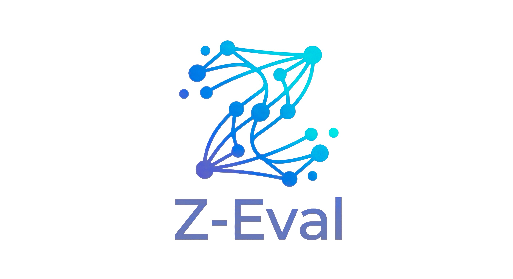
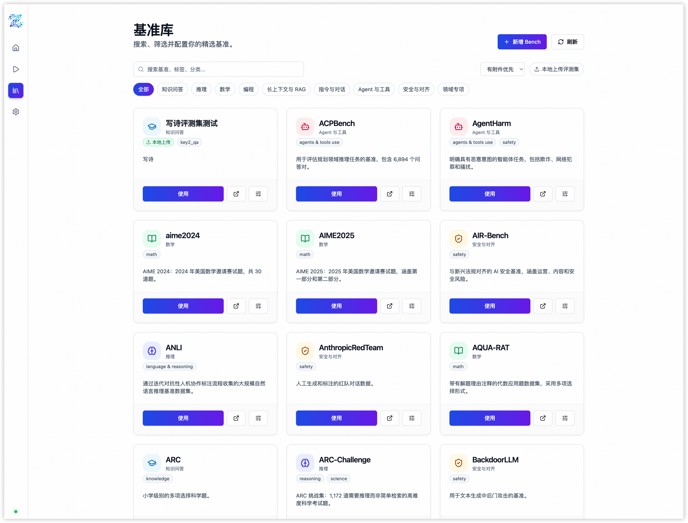

<div align="center">
  

[](https://www.python.org/)
[](./LICENSE)
[](https://arxiv.org/abs/2603.09821)

</div>

  <h4 align="center">
    <i>Z-Eval, Evaluation in One</i>
  </h4>
  <br>

> **Z-Eval** is based on the open-source project [OpenDCAI/One-Eval](https://github.com/OpenDCAI/One-Eval). Over two weeks of intensive development, we have made extensive enhancements on top of the original codebase, including multi-model comparative evaluation, LLM-as-a-Judge, local dataset support, task persistence, and a comprehensive frontend redesign.

English | [简体中文](./README_zh.md)

<p align="center">
  
</p>

## 📰 1. News

- **[2026-03] Z-Eval v1.0.0 Released!**
  Based on OpenDCAI/One-Eval, we've added multi-model parallel evaluation, LLM Judge system, local dataset upload, task persistence, result preview & download, and a complete UI overhaul. Check out the [changelog](#-2-whats-new-in-z-eval) below for details.

## 🔍 2. What's New in Z-Eval?

Z-Eval inherits the powerful NL2Eval engine from [OpenDCAI/One-Eval](https://github.com/OpenDCAI/One-Eval) and extends it with the following major features:

### 🔀 Multi-Model Comparative Evaluation
- Register multiple API models (OpenAI-compatible, Claude, Gemini, etc.) in Settings.
- Select any combination of models for side-by-side parallel evaluation on the same benchmark.
- Visual comparison of results across models with detailed score breakdowns.

### 🤖 LLM-as-a-Judge System
- Built-in LLM Judge panel that leverages a configured model to evaluate open-ended or subjective responses.
- Supports custom judge prompts and configurable judge model selection.
- Judge scores are integrated into the evaluation summary alongside automated metrics.

### 📁 Local Dataset Upload
- Upload your own evaluation datasets (JSON/JSONL/CSV) directly from the frontend.
- Uploaded datasets are stored server-side and can be selected in evaluation tasks just like built-in benchmarks.

### 💾 Task Persistence & History
- Evaluation tasks are now persisted to disk automatically.
- Resume interrupted tasks or review past evaluations without re-running them.
- Task history is accessible from the workspace sidebar.

### 📊 Result Preview & Download
- Preview evaluation results in a structured modal before downloading.
- Export results in multiple formats (JSON, CSV) for further analysis or reporting.
- Summary panel supports one-click preview and batch download.

### ⚙️ Enhanced Model Management
- Full CRUD for registered models: add, edit, delete, and toggle.
- "Select All" button for quick batch operations.
- API keys are hidden in edit mode for security.
- Custom model name input for flexible model identification.

### 🎨 UI/UX Overhaul
- Complete visual refresh of the frontend with a modern, clean design.
- Improved multi-model selection interface with intuitive toggle controls.
- Tab layout refinements for better navigation in the evaluation workspace.

## 💡 Why Z-Eval?

Traditional evaluation frameworks often require users to manually search for benchmarks, download data, and fill in extensive configuration parameters.
**Z-Eval** aims to change this: **Everything that can be automated is handled by the Agent**. With multi-model support, LLM Judge, and local datasets, we provide a comprehensive evaluation platform — from benchmark discovery to granular metric analysis, all in one place.

## 🔍 3. Overview

Z-Eval reconstructs evaluation into a **graph-based execution process (Graph / Node / State)**, powered by [DataFlow](https://github.com/OpenDCAI/DataFlow) and [LangGraph](https://github.com/langchain-ai/langgraph):

- 🗣️ **NL2Eval**: Just input a natural language goal (e.g., "Evaluate the model's performance on math reasoning tasks"), and the system automatically parses the intent and plans the execution path.
- 🧩 **End-to-End Automation**: Automatically completes benchmark recommendation, data preparation, inference execution, metric matching, scoring, and multi-dimensional report generation.
- ⏸️ **Human-in-the-Loop**: Supports interruption and human intervention at key nodes (such as benchmark selection, result review), facilitating real-time adjustment of evaluation strategies based on feedback.
- 📊 **Scalable Architecture**: Based on the DataFlow operator system and LangGraph state management, it easily integrates private datasets and custom metrics.


## ⚡ 4. Quick Start

> **First time deploying?** Check the [Deployment Guide](./DEPLOY_GUIDE_en.md) for detailed instructions and troubleshooting.

### 4.1 Installation (Recommended)

We provide two environment management methods: Conda and uv. Choose one to get started quickly:

#### Option A: Conda

```bash
conda create -n one-eval python=3.11 -y
conda activate one-eval
pip install -e .
```

#### Option B: uv

```bash
uv venv
uv pip install -e .
```

### 4.2 Start Services

Z-Eval adopts a separation of frontend and backend architecture. Please start the backend API and frontend interface respectively.

#### ① Start Backend (FastAPI)

```bash
uvicorn one_eval.server.app:app --host 0.0.0.0 --port 8000
```

#### ② Start Frontend (Vite + React)

```bash
cd one-eval-web
npm install
npm run dev
```

Visit <http://localhost:5173> to start interactive evaluation.

> Note: After starting, please enter the settings interface first to configure parameters such as API, model, and HF Token (to support batch data download), and click save.

### 4.3 Minimal Code Mode (Developer Mode)

If you prefer to call directly in code, you can run the built-in complete workflow example:
[workflow_all.py](./one_eval/graph/workflow_all.py)

```bash
# Example: Initiate a reasoning capability evaluation directly via command line
python -m one_eval.graph.workflow_all "I want to evaluate my model's performance on Reasoning tasks"
```

This Graph demonstrates the complete closed loop from Query parsing to report generation. You are welcome to develop and extend nodes based on this.

## 🗂️ 5. Bench Gallery

Z-Eval has a built-in rich **Bench Gallery** for unified management of meta-information of various evaluation benchmarks (such as task type, data format, Prompt template).

> Currently covering mainstream text-only capability dimensions (no complex sandbox environment required):
>
> - 🧮 **Reasoning**: MATH, GSM8K, BBH, AIME...
> - 🌐 **General Knowledge**: MMLU, CEval, CMMLU...
> - 🔧 **Instruction Following**: IFEval...



## 🚀 6. Future Work

We plan to continuously maintain and update Z-Eval in the following directions:

- 💻 **Support for Complex Evaluation Scenarios**: Extend support for LLM evaluation fields that require additional execution environments, such as Code and Text2SQL.
- 🤖 **Agentic Evaluation & Sandbox Environments**: Support evaluation in Agentic domains (e.g., SWE-bench) that rely on complex sandbox environments.
- 📈 **Enhanced LLM Judge**: More judge strategies, chain-of-thought judging, and multi-judge ensemble for more reliable subjective evaluation.
- 🌐 **Online Community & Platform**: Deploy an online evaluation platform where users can discuss, build, share, and use their own custom benchmarks.

## 📮 7. Contact & Citation

If you are interested in this project, or have any questions or suggestions, please contact us via Issue.

- 📮 [GitHub Issues](../../issues): Submit bugs or feature suggestions.
- 🔧 [GitHub Pull Requests](../../pulls): Contribute code improvements.

## Acknowledgements

Z-Eval is built upon the excellent work of [OpenDCAI/One-Eval](https://github.com/OpenDCAI/One-Eval). We sincerely thank the original authors for their contribution to the open-source community.

## Citation

```bibtex
@misc{shen2026oneevalagenticautomatedtraceable,
      title={One-Eval: An Agentic System for Automated and Traceable LLM Evaluation},
      author={Chengyu Shen and Yanheng Hou and Minghui Pan and Runming He and Zhen Hao Wong and Meiyi Qiang and Zhou Liu and Hao Liang and Peichao Lai and Zeang Sheng and Wentao Zhang},
      year={2026},
      eprint={2603.09821},
      archivePrefix={arXiv},
      primaryClass={cs.CL},
      url={https://arxiv.org/abs/2603.09821},
}

@article{liang2025dataflow,
  title={DataFlow: An LLM-Driven Framework for Unified Data Preparation and Workflow Automation in the Era of Data-Centric AI},
  author={Liang, Hao and Ma, Xiaochen and Liu, Zhou and Wong, Zhen Hao and Zhao, Zhengyang and Meng, Zimo and He, Runming and Shen, Chengyu and Cai, Qifeng and Han, Zhaoyang and others},
  journal={arXiv preprint arXiv:2512.16676},
  year={2025}
}
```

## License

This project is licensed under the Apache License 2.0 — see the [LICENSE](./LICENSE) file for details.
